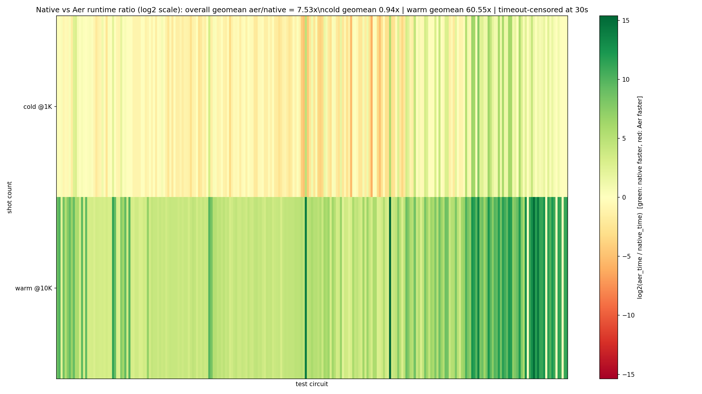

# Quantum Simulator

A state-vector quantum circuit simulator built from scratch with PyTorch, targeting Apple Silicon (MPS) as a first-class backend.



156 test circuits spanning 2-24 qubits, 10 circuit families, static and dynamic workloads. Benchmarked against Qiskit Aer (IBM's C++ simulator) across 5 shot counts. Per-cell color is `log2(aer_time / native_time)` — green means this simulator is faster.

Overall geometric mean across all 780 cells: **1.91x faster** than Aer (156 cases, 5 shot counts). At high shot counts (10K), native is **4.52x faster** (136/156 cases). Even at low shot counts (1-10), native now matches or beats Aer (1.13-1.48x). Compile-time inverse-pair cancellation collapses all 50 roundtrip circuits to identity in O(n) time.

## Why this exists

1. **There isn't a good MPS-native quantum simulator.** Qiskit and Cirq target CUDA. This project builds a performant simulator that runs well on Apple GPUs via PyTorch's MPS backend.

2. **Testbed for coding-agent-driven optimization.** The simulator ships with a benchmark harness, and the development workflow uses Claude Code to iteratively propose, implement, and validate performance improvements. The goal is to see how far a coding agent can push the performance of a real codebase through repeated optimize-measure-evaluate cycles.

## Quick start

```bash
uv sync
```

```python
from quantum import QuantumRegister, H, CX, run_simulation, measure_all

qr = QuantumRegister(2)
circuit = H(qr[0]) + CX(qr[0], qr[1]) + measure_all(qr)
result = run_simulation(circuit, 1000)
# {'00': 503, '11': 497}
```

Big-endian qubit ordering (qubit 0 is the leftmost bit). Supports CUDA, MPS, and CPU backends (auto-detected).

## Architecture

**API layer** (`src/quantum/gates.py`) — circuit-building primitives. Gates (`H`, `X`, `CX`, etc.), parametric gates (`RX`, `RY`, `RZ`), arbitrary controlled gates via `ControlledGateType`, measurements, conditional gates, quantum registers, and `Circuit` composition with `+`, `*`, and `.inverse()`.

**Simulation layer** (`src/quantum/system.py`) — executes circuits against state vectors. `BatchedQuantumSystem` runs many shots in parallel as a single `(batch_size, 2^n)` tensor. `run_simulation()` is the main entry point.

## Benchmark suite

```bash
uv run bench -v                         # full suite (156 cases, 30s timeout per shot)
uv run bench --timeout 60 -v            # custom timeout
uv run bench --cases real_grovers qft   # selected cases
uv run bench -v --backend aer           # same suite on Aer backend
```

See [`OPTIMIZE.md`](OPTIMIZE.md) for the optimization workflow.

## Examples

See `examples/` for standalone scripts: a Bell state, a simple Grover's search, and a full Grover's hash-preimage search.
