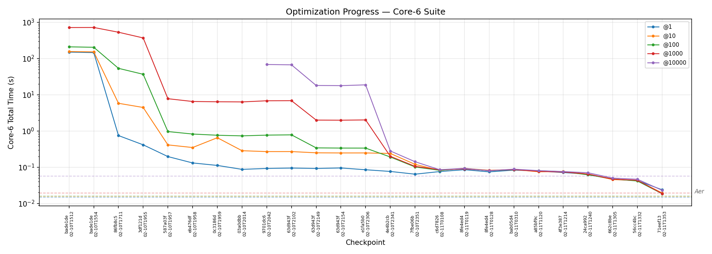

# Quantum Simulator

A state-vector quantum circuit simulator built from scratch with PyTorch, targeting Apple Silicon (MPS) as a first-class backend.

### Core-6 (saturated — at Aer parity)



| Shots | Baseline | Current | Speedup | Aer |
|---:|---:|---:|---:|---:|
| @1 | 150.39s | 0.024s | 6,300x | 0.015s |
| @10 | 156.37s | 0.019s | 8,100x | 0.016s |
| @100 | 210.54s | 0.019s | 11,400x | 0.016s |
| @1000 | 718.68s | 0.019s | 38,400x | 0.019s |

The core-6 reached Aer parity — these small circuits (2-13 qubits, 4-184 gates) no longer challenge the simulator. To drive further optimization, the benchmark suite was expanded to 156 cases spanning 2-24 qubits with circuits up to 1776 gates, covering 10 circuit families (BV, DJ, Grover, QPE, QAOA, GHZ, W-state, Graph-state, QFT, Simon) plus roundtrip and dynamic variants.

### Full suite (156 cases — active optimization target)


Full-suite progress data: [`docs/progress-data.md`](docs/progress-data.md). Core-6 data: [`docs/progress-data-core.md`](docs/progress-data-core.md). Detailed run log: [`docs/experiment-log.md`](docs/experiment-log.md).

## Why this exists

1. **There isn't a good MPS-native quantum simulator.** Qiskit and Cirq target CUDA. This project builds a performant simulator that runs well on Apple GPUs via PyTorch's MPS backend.

2. **Testbed for coding-agent-driven optimization.** The simulator ships with a benchmark harness, and the development workflow uses Claude Code to iteratively propose, implement, and validate performance improvements. The goal is to see how far a coding agent can push the performance of a real codebase through repeated optimize-measure-evaluate cycles.

## Quick start

```bash
uv sync
```

```python
from quantum import QuantumRegister, H, CX, run_simulation, measure_all

qr = QuantumRegister(2)
circuit = H(qr[0]) + CX(qr[0], qr[1]) + measure_all(qr)
result = run_simulation(circuit, 1000)
# {'00': 503, '11': 497}
```

Big-endian qubit ordering (qubit 0 is the leftmost bit). Supports CUDA, MPS, and CPU backends (auto-detected).

## Architecture

**API layer** (`src/quantum/gates.py`) — circuit-building primitives. Gates (`H`, `X`, `CX`, etc.), parametric gates (`RX`, `RY`, `RZ`), arbitrary controlled gates via `ControlledGateType`, measurements, conditional gates, quantum registers, and `Circuit` composition with `+`, `*`, and `.inverse()`.

**Simulation layer** (`src/quantum/system.py`) — executes circuits against state vectors. `BatchedQuantumSystem` runs many shots in parallel as a single `(batch_size, 2^n)` tensor. `run_simulation()` is the main entry point.

## Benchmark suite

```bash
uv run bench -v                  # full suite (156 cases, 30s timeout per shot)
uv run bench --core -v           # core-6 only (legacy)
uv run bench --timeout 60 -v    # custom timeout (seconds per case per shot count)
uv run bench --cases real_grovers qft
```

156 cases covering static circuits (terminal-only measurements), dynamic circuits (mid-circuit measurement + conditionals), and scaling stress tests from 2 to 24 qubits. Cases include 24 hand-coded benchmarks plus 132 QASM-loaded circuits auto-discovered from `benchmarks/circuits/`. Each run checks correctness against expected output distributions.

Cases are sorted by qubit count (small first) and results are written incrementally to JSONL — if a large case OOMs or the process is killed, all prior results are preserved. Cases exceeding the per-shot timeout (default 30s) or running out of memory are aborted and excluded from totals.

### SOTA comparison

```bash
uv run bench-compare -v                                    # native vs Aer
uv run bench-compare --core -v                             # core-6 only
uv run bench-compare --suite static --backends native aer qsim -v  # + qsim
uv run bench-compare-report benchmarks/results/compare-*.jsonl     # markdown report
```

## Optimization workflow

See [`OPTIMIZE.md`](OPTIMIZE.md) for the complete, self-contained optimization guide. It covers profiling, hypothesis formation, benchmarking, evaluation, and progress tracking.

## Examples

See `examples/` for standalone scripts: a Bell state, a simple Grover's search, and a full Grover's hash-preimage search.

## Key files

| File | Purpose |
|------|---------|
| `src/quantum/system.py` | Simulation engine |
| `src/quantum/gates.py` | Gate types and circuit API |
| `src/quantum/qasm.py` | QASM 2.0 parser |
| `OPTIMIZE.md` | Optimization workflow guide |
| `benchmarks/run.py` | Benchmark harness (`bench`) |
| `benchmarks/trace.py` | Profiler (`bench-trace`) |
| `benchmarks/compare.py` | SOTA comparison (`bench-compare`) |
| `benchmarks/cases/` | Hand-coded benchmark case definitions |
| `benchmarks/circuits/` | QASM circuit files (auto-discovered) |
| `benchmarks/expected/` | Expected distributions from Aer |
| `benchmarks/generate_circuits.py` | QASM circuit generator |
| `benchmarks/generate_expected.py` | Expected distribution generator (via Aer) |
| `docs/experiment-log.md` | Experiment log |
| `docs/progress-data.md` | Full-suite progress chart data |
| `docs/progress-data-core.md` | Core-6 progress chart data |
