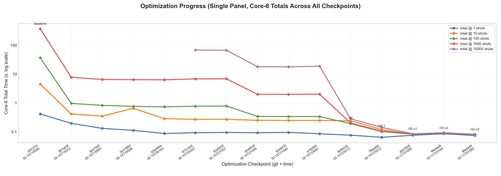

# Quantum Simulator

A state-vector quantum circuit simulator built from scratch with PyTorch, targeting Apple Silicon (MPS) as a first-class backend.

## Why this exists

1. **There isn't a good MPS-native quantum simulator.** Qiskit and Cirq target CUDA. This project aims to build a performant simulator that runs well on Apple GPUs via PyTorch's MPS backend.

2. **This is a testbed for coding-agent-driven optimization.** The simulator ships with a benchmark harness, and the development workflow uses Claude Code to iteratively propose, implement, and validate performance improvements. The goal is to see how far a coding agent can push the performance of a real codebase through repeated optimize-measure-evaluate cycles.

## Architecture

**API layer** (`src/quantum/gates.py`) — circuit-building primitives. Gates (`H`, `X`, `CX`, etc.), parametric gates (`RX`, `RY`, `RZ`), arbitrary controlled gates via `ControlledGateType`, measurements, conditional gates, quantum registers, and `Circuit` composition with `+`, `*`, and `.inverse()`.

**Simulation layer** (`src/quantum/system.py`) — executes circuits against state vectors. `BatchedQuantumSystem` runs many shots in parallel as a single `(batch_size, 2^n)` tensor. `run_simulation()` is the main entry point.

```python
from quantum import QuantumRegister, H, CX, run_simulation, measure_all

qr = QuantumRegister(2)
circuit = H(qr[0]) + CX(qr[0], qr[1]) + measure_all(qr)
result = run_simulation(circuit, 1000)
# {'00': 503, '11': 497}
```

Big-endian qubit ordering (qubit 0 is the leftmost bit). Supports CUDA, MPS, and CPU backends (auto-detected).

## Benchmark

```bash
uv run bench          # run all cases, print totals
uv run bench -v       # verbose: per-case timing + correctness details
uv run bench --cases real_grovers qft
uv run bench-plot     # plot the most recent results
```

Each benchmark case defines a circuit and its theoretical output distribution. The harness runs the full suite at fixed shot counts: 1, 10, 100, 1000, and 10000. Correctness is verified at the highest completed shot count by comparing the observed distribution against the expected one within a tolerance. If a case hits out-of-memory, the runner records it as an OOM failure and continues.

### Cases

| Case | Qubits | What it tests |
|------|--------|---------------|
| `bell_state` | 2 | Minimal circuit, baseline overhead |
| `simple_grovers` | 5 | Multi-controlled gates (Grover's search) |
| `real_grovers` | 13 | Deep circuit with hash oracle (Grover's preimage search) |
| `ghz_state` | 12 | Qubit scaling with shallow circuit (H + CX chain) |
| `qft` | 10 | Parametric controlled phase gates (QFT round-trip) |
| `teleportation` | 3 | Mid-circuit measurement and conditional gates |
| `phase_ladder` | 11 | Deep diagonal-gate stress (RZ + controlled phase round-trip) |
| `toffoli_oracle` | 11 | Toffoli-heavy nonlinear oracle round-trip |
| `adaptive_feedback` | 2 | Repeated mid-circuit measurement and conditional feedback |
| `ghz_state_16` | 16 | Larger GHZ scaling |
| `ghz_state_18` | 18 | Capacity-push GHZ scaling |
| `qft_12` | 12 | Larger QFT round-trip |
| `qft_14` | 14 | Deeper/larger phase-gate pressure |
| `phase_ladder_13` | 13 | Larger diagonal-gate stress |
| `toffoli_oracle_13` | 13 | Larger Toffoli-heavy oracle round-trip |
| `adaptive_feedback_120` | 2 | Long repeated measurement/conditional feedback |
| `reversible_mix_13` | 13 | Random reversible logic mix (X/CX/CCX round-trip) |
| `reversible_mix_15` | 15 | Larger reversible logic stress near backend limits |
| `clifford_scrambler_14` | 14 | Random Clifford scrambling + inverse |
| `brickwork_entangler_15` | 15 | Nearest-neighbor brickwork entangling pattern |
| `random_universal_12` | 12 | Random universal circuit (RX/RY/RZ/CX/CCX) round-trip |
| `random_universal_14` | 14 | Larger random universal round-trip |
| `diagonal_mesh_15` | 15 | Random long-range diagonal phase mesh round-trip |
| `adaptive_feedback_5q` | 5 | Mid-circuit feedback stress on larger state vectors |

Cases live in `benchmarks/cases/`.

Expanded synthetic families (randomized but reproducible with fixed seeds) are intentionally included in the default suite to broaden structural coverage across reversible logic, Clifford scrambling, universal gate mixes, diagonal phase meshes, and larger dynamic-feedback workloads.

## Optimization workflow

The core development loop:

1. **Reason** — review benchmark data, code, and prior runs
2. **Hypothesize** — decide one concrete change to test
3. **Implement** — apply the change in `src/quantum/system.py`
4. **Commit** — commit before running benchmarks
5. **Benchmark** — run `uv run bench -v` and evaluate correctness + timing
6. **Repeat** — use results to drive the next hypothesis

The multiple shot counts (1, 10, 100, 1000, 10000) surface optimizations that behave differently at different batch sizes. The correctness check guards against regressions.

### For coding agents

If you are a coding agent working on this project:

- The optimization target is `src/quantum/system.py`. Do not modify `gates.py` or the benchmark cases.
- Run `uv run bench -v` after every change. Always commit after modifying code but before running the benchmark.
- The benchmark must pass all correctness checks. A faster but incorrect simulator is useless.
- Before making code changes, develop a well-reasoned hypothesis about the potential impact on performance. After running the benchmark, compare the results with previous runs to evaluate the effectiveness of the optimization and the accuracy of the hypothesis. Use this information to construct your next hypothesis and guide future optimizations.

## Performance tracker

Latest full benchmark artifact:

- Run: `benchmarks/results/2026-02-11T012820.jsonl`
- Commit: `8fe4ed4`
- Completed correctness: 22/22 PASS (with known MPS rank-limit failures on `ghz_state_16` and `ghz_state_18`)

### Progress



Progress summary:

| Scope | Baseline | Latest | Speedup |
|---|---:|---:|---:|
| Core-6 suite total @1000 (`3df121d` -> latest) | 370.99s | 0.081s | 4574.5x |
| Expanded suite total @1000 (`2026-02-10T230611` -> latest) | 60.33s | 2.67s | 22.6x |
| Expanded suite total @10000 (`2026-02-10T230611` -> latest) | 592.91s | 2.85s | 207.8x |

### Latest SOTA Comparison

| Scope | Shot count | Native | Aer | qsim | Native vs Aer | Native vs qsim |
|---|---:|---:|---:|---:|---:|---:|
| Full suite | 1000 | 2.5505s | 0.6116s | n/a | 4.17x slower | n/a |
| Full suite | 10000 | 2.6881s | 2.9460s | n/a | 1.10x faster | n/a |
| Static intersection | 1000 | 0.9772s | 0.2119s | 0.2121s | 4.61x slower | 4.61x slower |
| Static intersection | 10000 | 0.9614s | 0.2814s | 0.2188s | 3.42x slower | 4.39x slower |
| Dynamic subset (full) | 1000 | 1.6367s | 0.3979s | n/a | 4.11x slower | n/a |
| Dynamic subset (full) | 10000 | 1.7734s | 2.6633s | n/a | 1.50x faster | n/a |

Detailed run log and profiler notes: `docs/02-attempt-history.md`.
Narrative docs index: `docs/README.md`.

## Setup

```bash
uv sync
```

## Examples

See `examples/` for standalone scripts: a Bell state, a simple Grover's search, and a full Grover's hash-preimage search.
