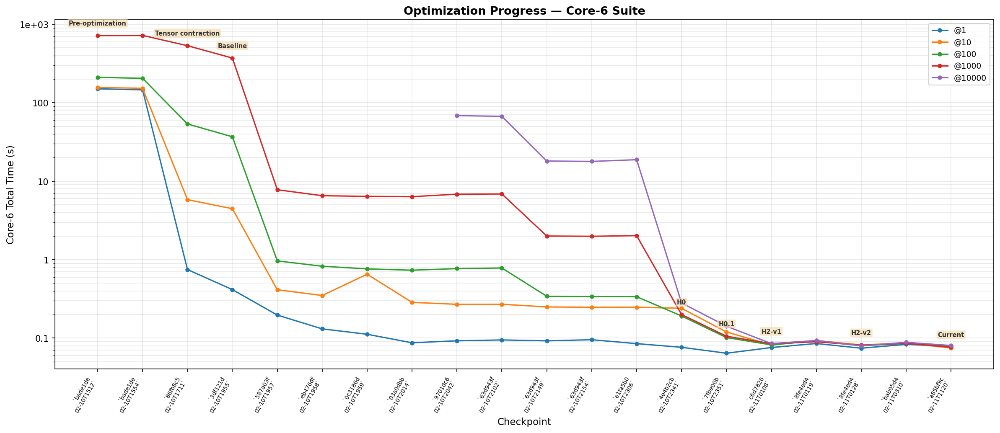

# Quantum Simulator

A state-vector quantum circuit simulator built from scratch with PyTorch, targeting Apple Silicon (MPS) as a first-class backend.



| Scope | Baseline | Latest | Speedup |
|---|---:|---:|---:|
| Core-6 @1000 | 718.68s | 0.077s | 9,375x |
| Expanded suite @1000 | 60.33s | 2.48s | 24x |
| Expanded suite @10000 | 592.91s | 2.48s | 239x |

Raw data: [`docs/progress-data.md`](docs/progress-data.md). Detailed run log: [`docs/experiment-log.md`](docs/experiment-log.md).

## Why this exists

1. **There isn't a good MPS-native quantum simulator.** Qiskit and Cirq target CUDA. This project builds a performant simulator that runs well on Apple GPUs via PyTorch's MPS backend.

2. **Testbed for coding-agent-driven optimization.** The simulator ships with a benchmark harness, and the development workflow uses Claude Code to iteratively propose, implement, and validate performance improvements. The goal is to see how far a coding agent can push the performance of a real codebase through repeated optimize-measure-evaluate cycles.

## Quick start

```bash
uv sync
```

```python
from quantum import QuantumRegister, H, CX, run_simulation, measure_all

qr = QuantumRegister(2)
circuit = H(qr[0]) + CX(qr[0], qr[1]) + measure_all(qr)
result = run_simulation(circuit, 1000)
# {'00': 503, '11': 497}
```

Big-endian qubit ordering (qubit 0 is the leftmost bit). Supports CUDA, MPS, and CPU backends (auto-detected).

## Architecture

**API layer** (`src/quantum/gates.py`) — circuit-building primitives. Gates (`H`, `X`, `CX`, etc.), parametric gates (`RX`, `RY`, `RZ`), arbitrary controlled gates via `ControlledGateType`, measurements, conditional gates, quantum registers, and `Circuit` composition with `+`, `*`, and `.inverse()`.

**Simulation layer** (`src/quantum/system.py`) — executes circuits against state vectors. `BatchedQuantumSystem` runs many shots in parallel as a single `(batch_size, 2^n)` tensor. `run_simulation()` is the main entry point.

## Benchmark suite

```bash
uv run bench          # run all cases, print totals
uv run bench -v       # verbose: per-case timing + correctness details
uv run bench --cases real_grovers qft
```

24 cases covering static circuits (terminal-only measurements), dynamic circuits (mid-circuit measurement + conditionals), and scaling stress tests from 2 to 18 qubits. Cases live in `benchmarks/cases/`. Each run checks correctness against expected output distributions.

### SOTA comparison

```bash
uv run bench-compare -v                                    # native vs Aer
uv run bench-compare --suite static --backends native aer qsim -v  # + qsim
uv run bench-compare-report benchmarks/results/compare-*.jsonl     # markdown report
```

| Scope | Shots | Native | Aer | qsim |
|---|---:|---:|---:|---:|
| Full suite | 1000 | 2.55s | 0.61s | n/a |
| Full suite | 10000 | 2.69s | 2.95s | n/a |
| Static intersection | 1000 | 0.98s | 0.21s | 0.21s |
| Dynamic subset | 10000 | 1.77s | 2.66s | n/a |

## Optimization workflow

See [`OPTIMIZE.md`](OPTIMIZE.md) for the complete, self-contained optimization guide. It covers profiling, hypothesis formation, benchmarking, evaluation, and progress tracking.

## Examples

See `examples/` for standalone scripts: a Bell state, a simple Grover's search, and a full Grover's hash-preimage search.

## Key files

| File | Purpose |
|------|---------|
| `src/quantum/system.py` | Simulation engine |
| `src/quantum/gates.py` | Gate types and circuit API |
| `OPTIMIZE.md` | Optimization workflow guide |
| `benchmarks/` | Benchmark harness, profiler, SOTA comparison |
| `docs/experiment-log.md` | Experiment log |
| `docs/progress-data.md` | Raw progress chart data |
