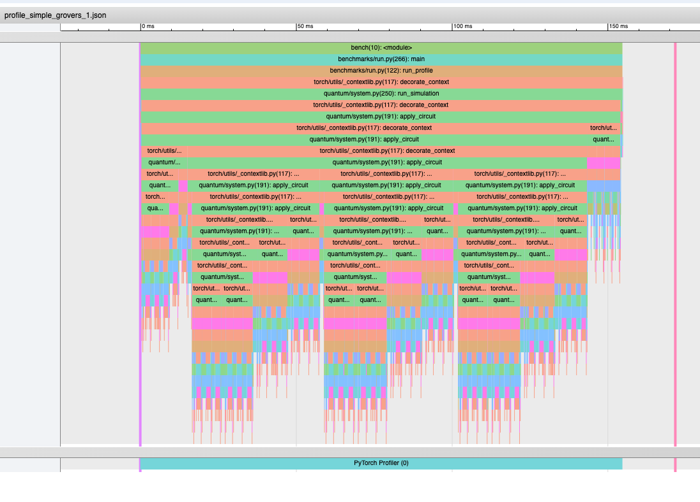
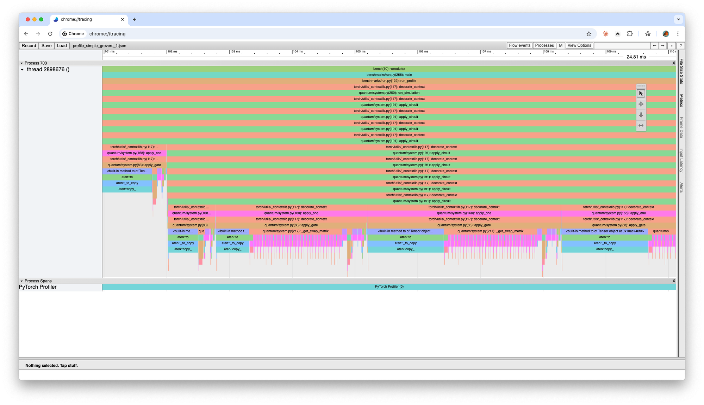

# Baseline Profiler Analysis

Historical note: this document captures the pre-tensor-contraction baseline.
For the latest post-optimization results, see `docs/optimization-progress-2026-02-10.md`.

Profiled with `torch.profiler` on Apple M1 Max, MPS backend, PyTorch 2.9.0.

Trace file: `profile_simple_grovers_1.json` — 5 qubits, 64 ops, 1 shot.

## Overview

The full trace spans ~150ms. Key observations:

- **The entire duration is solid CPU work.** There are no gaps or idle periods — the CPU is the bottleneck, not the MPS GPU.
- **Deep recursive call stack.** `apply_circuit` calls itself repeatedly (nested green/orange bars), with each gate triggering a deep dispatch chain through `_contextlib` decorators.
- **Dense rainbow at the bottom.** Hundreds of tiny torch operations (`kron`, `copy_`, `mm`, etc.) are packed together. Each colored sliver is a separate MPS dispatch.
- **No meaningful GPU utilization.** The "PyTorch Profiler (0)" bar at the bottom is a single flat block — the GPU has essentially nothing to do while the CPU burns time constructing matrices.

## Zoomed: Individual Gate Application

Zooming into ~101ms–110ms reveals the per-gate pattern:

1. **`aten::to` / `aten::_to_copy` / `aten::copy_`** — Gate tensor copied to MPS device on *every* gate application (`gate.tensor.to(self.device)` at `system.py:94`). This should be cached.

2. **`_get_swap_matrix`** (large blue/purple blocks) — Python for-loop building a `2^n x 2^n` permutation matrix element by element. At 5 qubits this is a 32x32 matrix; at 13 qubits it's 8192x8192. This is the single most wasteful function in the hot path.

3. **Actual computation** (thin pink/magenta slivers at the bottom) — The `kron` and `mm` calls that do "real work" are a tiny fraction of each gate's total time. The vast majority is overhead.

4. **Pattern repeats identically per gate:** device transfer → swap matrix construction → Kronecker product chain → matmul → undo swaps → renormalize. For the 13-qubit `real_grovers` circuit with 184 ops, this pattern executes 184 times with 8192x8192 matrices.

## Confirmed Hypotheses

| Hypothesis | Status | Evidence |
|---|---|---|
| H1: Full matrix construction dominates | **Confirmed** | CPU is 100% utilized building matrices. GPU is idle. The actual matmul (pink slivers) is tiny. |
| H2: Swap matrix is the worst single function | **Confirmed** | `_get_swap_matrix` is clearly visible as a major time consumer per gate — the blue/purple blocks. |
| H4: Per-gate renormalization is waste | **Confirmed** | `aten::sum`, `aten::sqrt`, `aten::abs`, `aten::div` appear after every gate. |
| H5: MPS dispatch overhead compounds | **Visible** | Hundreds of tiny operations packed together. Each is a separate Metal dispatch. |

## Baseline Timing (pre-optimization)

| Case | Qubits | Ops | 1 shot | 1000 shots |
|---|---|---|---|---|
| bell_state | 2 | 4 | 0.007s | 1.83s |
| simple_grovers | 5 | 64 | 0.15s | 4.19s |
| real_grovers | 13 | 184 | 140.4s | 527.3s |
| ghz_state | 12 | 24 | 2.16s | 160.9s |
| qft | 10 | 120 | 7.66s | 21.96s |
| teleportation | 3 | 12 | 0.02s | 2.44s |
| **Total** | | | **150.4s** | **718.7s** |
